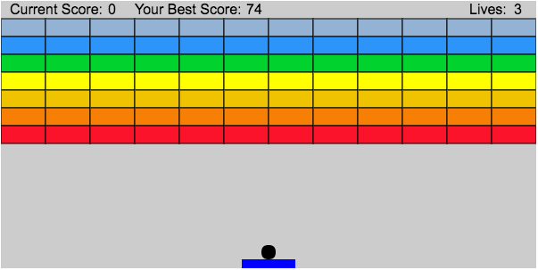
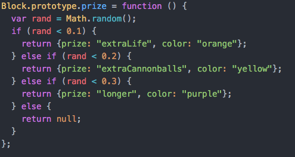
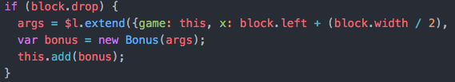

# Javanoid

Javanoid is a browser game built with javascript and canvas.  The player uses his paddle to aim the ball at bricks to break them.  The game continues as long as the ball stays in frame.

[Wanna play?](http://www.conorjdevine.com/Javanoid)

## Technical

When a block is instantiated, a random number generator determines what if any bonus is will contain.

Once that block is hit by the cannonball, a new bonus object is created with its properties determined by the block which contained it.

